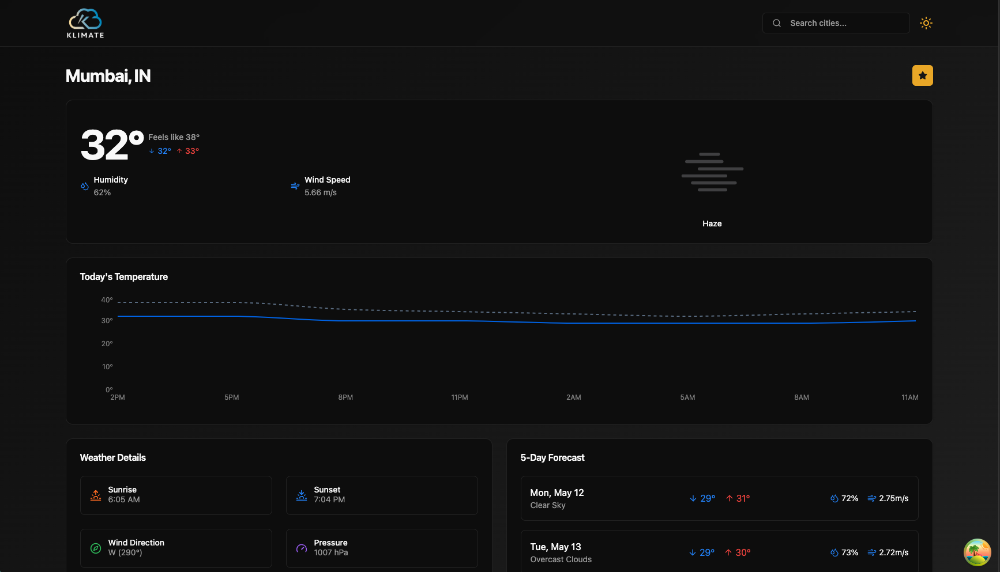

<h1 align="center">Klimate - A Modern Weather App </h1>
<br>

## Introduction
Klimate is a sleek and modern weather application designed to provide accurate and up-to-date weather information at your fingertips. Whether you're planning your day, preparing for a trip, or simply curious about the weather, Klimate offers a seamless and intuitive experience. 

<p align="center">

</p>


With its clean user interface and powerful features, Klimate allows you to:
- View current weather conditions for any location.
- Access detailed forecasts, including temperature, humidity, wind speed, and more.
- Explore hourly and weekly weather trends to stay ahead of changing conditions.
- Enjoy a responsive design that works flawlessly across devices.

Built with cutting-edge technologies, Klimate ensures reliability and speed, making it your go-to weather companion. Stay informed and plan smarter with Klimate!

## Tech Stack

<h4>
Klimate is built using the following modern technologies:
</h4>

<h4>

| **Technology**       | **Description**                                                                 |
|-----------------------|---------------------------------------------------------------------------------|
|      | A JavaScript library for building user interfaces.                   |
|  | A strongly typed programming language that builds on JavaScript.     |
|  | A utility-first CSS framework for rapid UI development.              |
|   | A collection of accessible and customizable UI components.           |
|  | Powerful data-fetching and state management for React.               |
|  | A charting library for building intuitive data visualizations.       |
|   | A platform for deploying modern web applications with ease.          |
</h4>

## Features 🌟

Klimate offers a range of features to make your weather-checking experience seamless and enjoyable:

- **🌍 Location-Based Weather**: Automatically fetches your current location's weather using location permissions.
- **🔍 Search Functionality**: Search for weather updates in any city worldwide.
- **❤️ Favorites**: Save your favorite locations for quick access to their weather updates.
- **📊 Detailed Forecasts**: Get comprehensive weather details, including temperature, humidity, wind speed, and more.
- **📅 Hourly & Weekly Trends**: Stay ahead with hourly and weekly weather forecasts.
- **📱 Responsive Design**: Enjoy a flawless experience across all devices.

---

## How to Use 🚀

Follow these steps to get started with Klimate:

1. **Clone the Repository**:
    ```bash
    git clone https://github.com/codewmanas/Klimate.git
    cd Klimate
    ```

2. **Install Dependencies**:
    ```bash
    npm install
    ```

3. **Set Up Environment Variables**:
    Create a `.env` file in the root directory and add your OpenWeather API key:
    ```env
    VITE_OPENWEATHER_API_KEY=your_api_key_here
    ```

4. **Run the Application**:
    ```bash
    npm run dev
    ```

5. **Access the App**:
    Open your browser and navigate to `http://localhost:5173`.

---

## Walkthrough 🧭

1. **Grant Location Access**:
    - Upon launching the app, Klimate will request location permissions to fetch your current weather. Allow access for a personalized experience.

2. **Search for Other Locations**:
    - Use the search bar to find weather updates for any city worldwide.

3. **Add to Favorites**:
    - Save frequently checked locations to your favorites for quick access.

4. **Explore Weather Details**:
    - Dive into detailed weather information, including temperature, humidity, wind speed, and more.

5. **Plan Ahead**:
    - Use hourly and weekly forecasts to stay prepared for upcoming weather changes.

---

## Contributing 🤝

Contributions are welcome! If you'd like to improve Klimate, feel free to fork the repository, make your changes, and submit a pull request. Let's make Klimate even better together!

---

## Acknowledgements 🙌

- **OpenWeather API**: For providing reliable weather data.
- **React Community**: For the amazing tools and libraries.
- **Vercel**: For seamless deployment.

---

## Disclaimer ⚠️

This project does not include a license. All rights reserved by the author, Manas Kolaskar. Please contact the author for permissions regarding usage or distribution.

---

Thank you for checking out Klimate! 🌤️ Stay informed, stay prepared, and enjoy the weather! 😊
